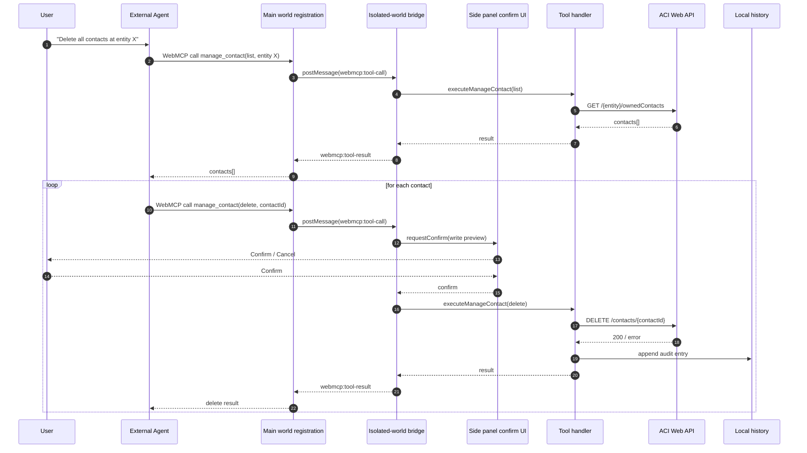

```mermaid
sequenceDiagram
    autonumber
    participant U as User
    participant A as External Agent
    participant MW as Main world registration
    participant IW as Isolated-world bridge
    participant SB as Side panel confirm UI
    participant TH as Tool handler
    participant API as ACI Web API
    participant H as Local history

    U->>A: "Delete all contacts at entity X"
    A->>MW: WebMCP call manage_contact(list, entity X)
    MW->>IW: postMessage(webmcp:tool-call)
    IW->>TH: executeManageContact(list)
    TH->>API: GET /{entity}/ownedContacts
    API-->>TH: contacts[]
    TH-->>IW: result
    IW-->>MW: webmcp:tool-result
    MW-->>A: contacts[]

    loop for each contact
        A->>MW: WebMCP call manage_contact(delete, contactId)
        MW->>IW: postMessage(webmcp:tool-call)
        IW->>SB: requestConfirm(write preview)
        SB-->>U: Confirm / Cancel
        U-->>SB: Confirm
        SB-->>IW: confirm
        IW->>TH: executeManageContact(delete)
        TH->>API: DELETE /contacts/{contactId}
        API-->>TH: 200 / error
        TH->>H: append audit entry
        TH-->>IW: result
        IW-->>MW: webmcp:tool-result
        MW-->>A: delete result
    end
```

Note over A,H: Jobs tab is not used here unless execution goes through execute_workflow + job runner.