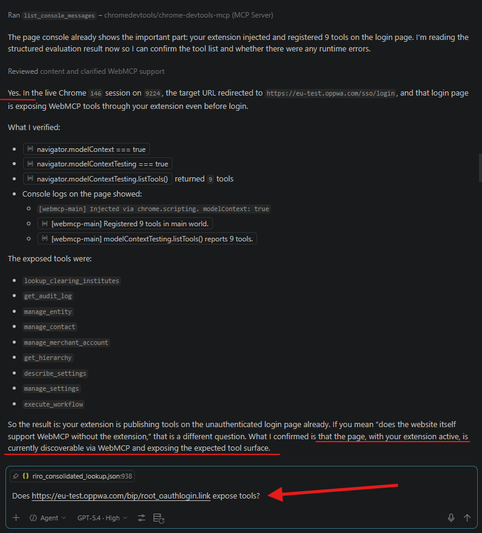
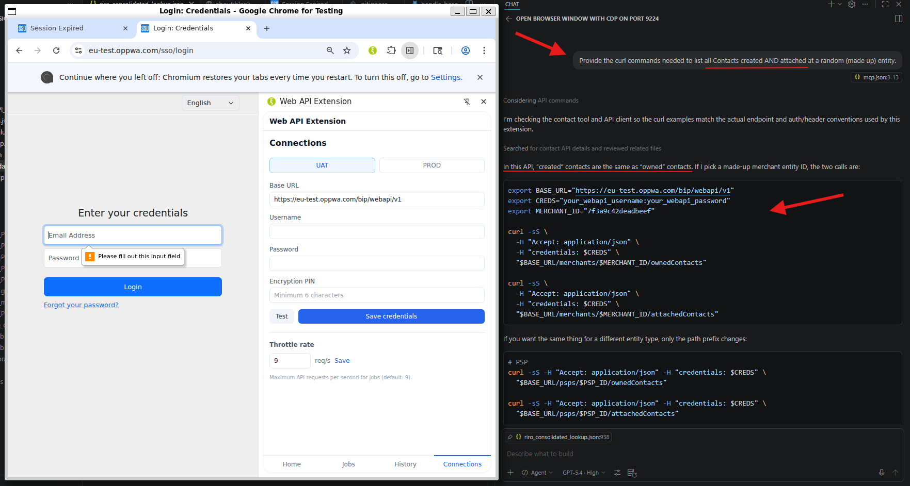
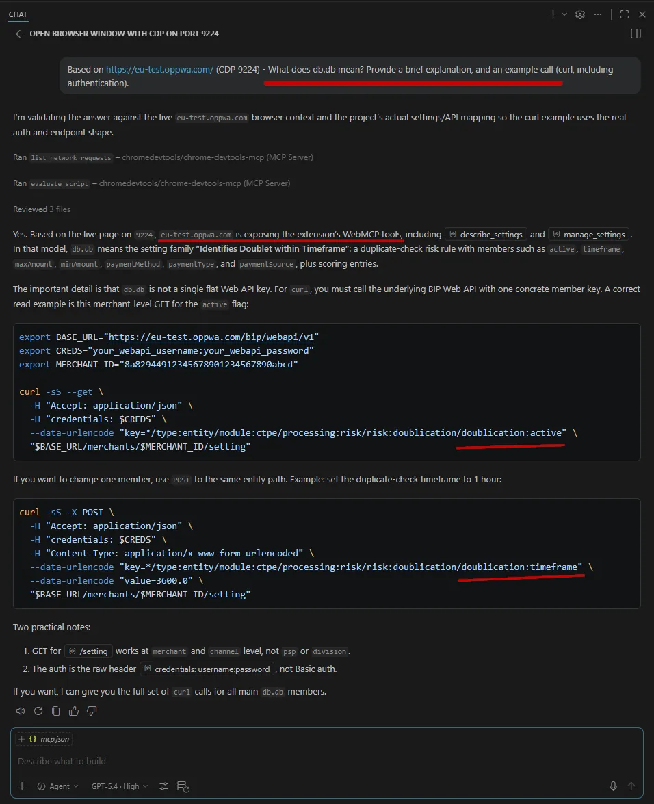
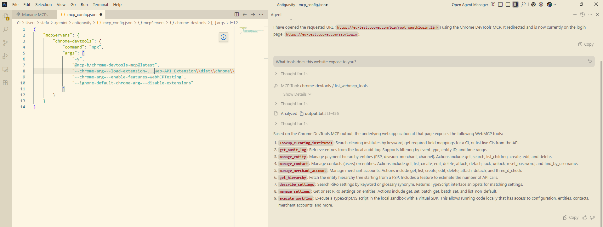
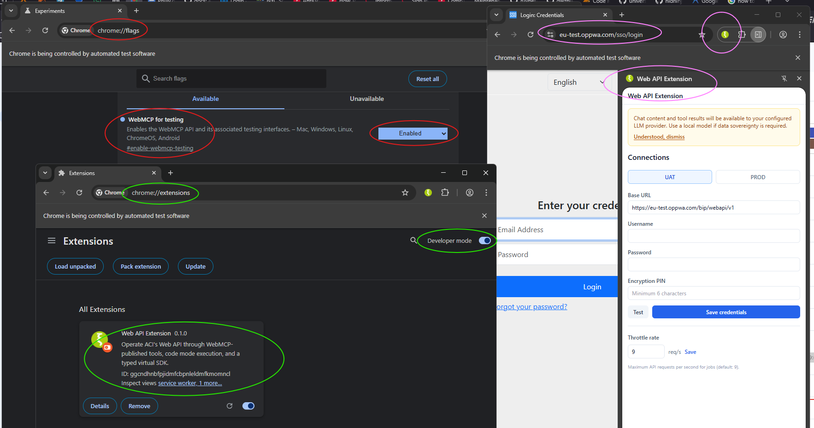
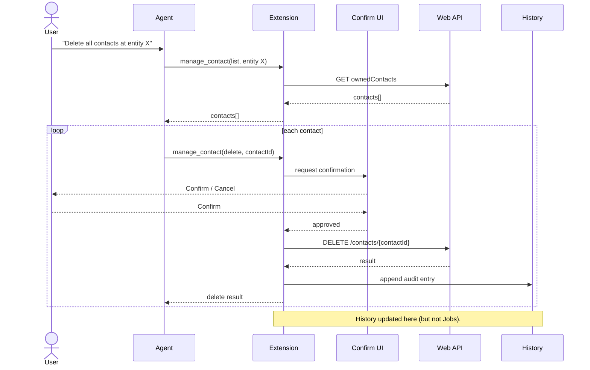
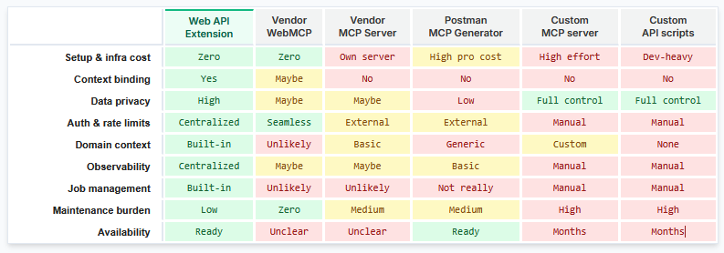

# Web API Extension

**Web API Extension** is a Chrome extension that lets ACI customers operate their SaaS via Web API (Merchant Onboarding API). It uses WebMCP for in-browser tool publication, UTCP for efficient tool orchestration, and code mode for local script execution -- representing the most modern, fastest, and most secure approach to SaaS automation via API.

**Web API Extension** replaces the legacy "Web API MCP Server" with a browser-native, zero-infrastructure alternative that uses the active SaaS tab for context binding, executes logic locally, and minimizes data exposure to external LLM providers.

**Web API Extension** represents a paradigm shift in SaaS API automation. Unlike traditional MCP servers or generic tools like Postman that require costly backend infrastructure and operate blindly, this extension acts as a zero-infrastructure "Virtual SDK" directly within the user's browser. By executing logic locally and binding to the active dashboard session, it securely bridges the gap between what the users see and what the AI agents can do. The result is immediate, domain-aware automation with unparalleled data privacy - without the maintenance burden or security risks of a custom backend.

<table>
    <thead>
        <tr>
            <th>
                Does the SaaS website expose tools?
            </th>
            <th>
                Provide the calls needed to list all users, in curl.
            </th>
            <th>
                What does db.db mean? Explanation + example calls.
            </th>
        </tr>
    </thead>
    <tbody>
        <tr>
            <td valign="top" align="center">
                <kbd>
                    
                </kbd>
            </td>
            <td valign="top" align="center">
                <kbd>
                    
                </kbd>
            </td>
            <td valign="top" align="center">
                <kbd>
                    
                </kbd>
            </td>
        </tr>
    </tbody>
</table>

## Overview

The extension is a *Client-Side Adapter*. The <a href="https://github.com/snlr308/Web_API_MCP2" alt="legacy">legacy MCP server</a> was a tool-wrapper &ndash; but *this* is a *Virtual SDK*. Instead of an agent talking to a remote server that then talks to the SaaS, the agent talks to the extension, which uses the active browser session to interact with the SaaS:

- **Exposes the full Web API** to any WebMCP-compatible AI agent running in Chrome.  
- **Automates the SaaS via its API** using only a browser extension: no backend proxy, no MCP server, no external credential files or secret stores.  
- **>90% context-window reduction** compared to the legacy MCP approach by using type-on-demand discovery and code-mode execution.  
- **Faster and more accurate tool use** compared to the legacy MCP.  
- **Authentication hand-off**: extension runs in the user's browser, leveraging the user's existing login session. Also, CORS is now simple. 
- **Context injection**: extension can "see" what the user is looking at on the SaaS dashboard and provide that as real-time context to the agent.  
- **Hybrid interaction**: WebMCP tools can perform two types of actions: *API Actions*: Call the SaaS API directly using fetch() from the background script. *UI Actions*: If the API is missing a specific feature, the extension can inject a script to click a button or scrape data directly from the DOM.  
- Transferable showcase: Architecture works for any SaaS with a keyed-property API.  

**Non-goals (v1):**

- Does not replace the SaaS dashboard UI for human-only workflows. It complements it.
- Does not support offline or disconnected operation.
- No mobile browser support.
- No multi-tenant profile switching. Dual-env: yes.
- No built-in LLM or chat UI. Extension is a tool provider, not an agent host.

## Install

### Prerequisites

- Google Chrome **146+** (Canary or Dev channel at the time of writing)
- WebMCP testing flag enabled: navigate to `chrome://flags/#enable-webmcp-testing` and set it to **Enabled**
- Node.js 20+ and npm 10+

### Build the extension

```bash
git clone <repo-url> && cd Web-API_Extension
npm install
# npm run dev        # development mode with hot reload
# -- or --
npm run build      # production build
```

### Load the extension in Chrome

1. Open `chrome://extensions`
2. Enable **Developer mode** (top right)
3. Click **Load unpacked** and select the `dist/chrome-mv3-dev` (dev) or `dist/chrome-mv3-prod` (build) folder
4. Recommendation: "Pin" the extension to the bookmark toolbar
5. Click Extension icon to open the side panel

### Permissions

| Extension requests: | Purpose |
|---|---|
| `sidePanel` | Primary UI surface |
| `storage` | Encrypted credential storage (local) and decrypted session cache (session) |
| `activeTab` | Detect active BIP tab for context binding |
| `scripting` | Content script injection for dashboard context detection |

Host permissions grant fetch access to `eu-test.oppwa.com` (UAT) and `eu-prod.oppwa.com` (Prod).


## Usage

### First run

1. Open the side panel -> **Connections** tab,
2. Enter Web API credentials (username and password) for UAT, Prod, or both,
3. Choose a PIN (minimum 6 digits). Store PIN in external tool.
4. On later visits, enter PIN to unlock. Credentials are encrypted with PBKDF2 + AES-GCM-256 and stored in `chrome.storage.local`. The decrypted credentials in `chrome.storage.session` survive idle, but are cleared on browser restart. 

> **Any LLM with browser-capability** can now connect to the *oppwa.com site, and provide the same functionality an MCP server would, based on the 9 exposed tools and enriched OpenAPI specs.

### Example workflow using Google Gemini (browser side panel)

*WebMCP not supported by Gemini as of 2026-03-27 (Chrome side panel, including Google AI Pro and Ultra tiers).* Gemini can be used as the LLM Chat tool performing the requested actions. Gemini already sits inside the browser. The workflow from enduser point of view:

- Install the extension in Chrome (min-version, set flag)
- Open an oppwa.com page (UAT or Prod)
- Open the Web API Extension side panel once, and:
    - Set credentials in "Connections"
    - Set a PIN (track value externally)
    - Test connection
    - Close the side panel
- On the same active oppwa.com tab, open Gemini side panel
- Ask Gemini to list available tools, or perform an action

### Example workflow using Antigravity (IDE)

Antigravity does not yet *natively* support WebMCP (2026-03-27). Suggested workaround:

```json
{
    "mcpServers": {
        "chrome-devtools": {
            "command": "npx",
            "args": [
                "-y",
                "@mcp-b/chrome-devtools-mcp@latest",
                "--chrome-arg=--load-extension=u:\\home\\snlr\\code\\Web-API_Extension\\dist\\chrome\\",
                "--chrome-arg=--enable-features=WebMCPTesting",
                "--ignore-default-chrome-arg=--disable-extensions"
            ]
        }
    }
}
```

- Add the above to `mcp_config.json` in Antigravity.
- This adds a custom Chrome DevTools (mcp-b) that does have WebMCP support to Antigravity.
- Seems counter-intiutive - Web API Extension sits in the browser without need for an MCP server.
- This is still correct, but for now this custom MCP server is a wrapper, adding WebMCP to AG.
- Once AG supports WebMCP, this wrapper will not be needed anymore.

Config: <br>
<kbd></kbd>

**Result:** <br>
<kbd></kbd>


### Example workflow using VS Code Insiders (IDE)

VS Code Insiders does have WebMCP support. 

- Config needed to persist experimental flag and unpacked extension:
- [add here]


## Features

### Practical flow example

<details>
  <summary>Walkthrough of what technically happens for a common prompt: "Delete x from y" ...</summary>

1. User prompts: *"Delete all Contacts from this Entity."*
2. Agent sees which Entity, gets confirmation from user
3. The tool `manage_contact` supports list and delete, but not “delete all” as one atomic action. The agent would either:
    - Call manage_contact with action: "list" to get all contacts for entity X, then call manage_contact with action: "delete" once per contact.
    - For a larger batch, call `execute_workflow` and let the local script iterate and delete (will not be a tracked background Job).
4. The agent reasons:
    - first I need the contacts on that entity
    - then I need to delete them
    - the relevant tool is manage_contact

And calls:

```json
{
  "tool": "manage_contact",
  "params": {
    "action": "list",
    "entityType": "merchant",
    "entityId": "X",
    "scope": "owned"
  }
}
```
That call goes into the WebMCP registration callback in `register-main.ts`.

5. The tool call is passed from main world to isolated world. The main-world registration code does not execute the business logic directly. It posts a message: type / tool / params / callId. The isolated-world bridge listens for that message. This bridge exists because the isolated world has access to extension APIs and storage, while the page main world does not
    - main world = visible to WebMCP/browser agent
    - isolated world = trusted execution layer with credentials and chrome APIs
6. The extension dispatches the call to the real handler: Inside `bridge.ts`, the call is routed through `EXECUTE_MAP`. For manage_contact, that means:
    - resolve active environment
    - load decrypted credentials from extension session storage
    - if the action is mutating, trigger the confirmation bridge
    - then call `manage-contact.ts`
7. At this point the extension absolutely knows:
    - which tool was called
    - with which params
    - in which environment
    - whether it is read-only or mutating (History)
8. If it is a write, the extension asks the user to confirm: Before the actual API call happens, `bridge.ts` creates a preview and sends it to `confirm-bridge`. The side panel is subscribed to that bridge and renders `ConfirmDialog.tsx`.
9. The tool handler makes the API request: Once confirmed, `manage-contact.ts` runs the relevant branch. For delete, that goes to `manage-contact.ts`, which calls `api-client.ts` with:
    - method DELETE
    - path /contacts/{contactId}
    - header credentials: username:password
10. In effect, the extenstion is acting as the local API client. Finally, it records local history. Because `deleteContact` passes audit metadata, `api-client.ts` appends an audit entry into `chrome.storage.local.audit`. This is rendered in the "History" tab, `RunHistoryPage.tsx`.
11. History tab shows:
    - event type contact_delete
    - entity id
    - environment
    - response status
    - timestamp
12. The result is returned to the agent: The isolated-world bridge posts a `webmcp:tool-result` message back to the main world in `bridge.ts`. Then `register-main.ts` resolves the pending tool promise, and the external agent receives the result.

</details>

### History

The user's LLM agent does not call the Web API. It calls the extension's WebMCP tool. The extension knows the action before the HTTP request even exists:

- Extension receives the tool call
- Loads credentials
- Enforces confirmation
- Performs fetch
- Records audit/history
- Returns result


### Jobs

Long-running scripts (e.g. a hierarchy-wide settings audit at 9 req/s) run as background jobs:

- **Progress monitor** in the Jobs tab shows state (running / paused / completed / failed), estimated time remaining, and call count.
- **Pause/resume** -- user-initiated or automatic on tab close. State is persisted to `chrome.storage.local`.
- **Browser restart recovery** -- on startup, incomplete jobs are marked as paused and offered for resume after re-authentication.
- **Cancel** produces partial results.

Jobs are created when Extension's job system is used explicitly, via `job-runner.ts` and the service worker executor in `sw-job-executor.ts`. Jobs are only used via execute_workflow + job runner, they are independent from History.


### History / Jobs diagram




### Scripts

Scripts are written by the external agent:

- The agent writes the script text.
- The extension executes that script locally (browser).
- The extension constrains what the script can do.
- (A human could also write the script manually and pass it to `execute_workflow`.)

Example flow in practice:

1. Agent inspects the available tools and maybe calls read tools first, like `manage_contact`, `get_hierarchy`, or `describe_settings`.
2. For a larger multi-step task, the agent composes a short imperative script.
3. Agent sends that script to `execute_workflow`.
4. Extension runs it through the sandbox in `sandbox.ts`.


**What constrains the script**
- The script does not get raw extension internals. It gets an injected `sdk`, `console`, `sleep`, `results`, `context`, `signal`, and `progress` from sandbox.ts.
- The `sdk` is a curated facade from sdk-facade.ts, not arbitrary browser or extension access.
- For config settings, the virtual SDK in sdk.ts provides typed paths, flattening, and validation instead of making the agent handcraft flat RiRo keys.

**Quality controls**
- `describe_settings` gives the agent structured, typed setting metadata first, via describe-settings.ts. That helps the agent write a better script.
- The SDK facade exposes higher-level methods like `sdk.contacts.list`, `sdk.contacts.delete`, and `sdk.config.update` in sdk-facade.ts - better than having the agent invent raw HTTP calls.
- Settings writes go through validation and flattening in sdk.ts.
- Write operations go through the confirm bridge in confirm-bridge.ts, so even a good script still needs user approval before mutation.
- API mutations are audit-logged by api-client.ts.
- The sandbox supports `dryRun`, timeout, cancellation, logs, and captured results in sandbox.ts.
- `dryRun` checks parseability, not business correctness.
- The extension governs quality mainly through constrained SDK shape, typed discovery, validation, confirmation, timeout/cancel, and audit.
- There is no full compiler-grade or lint-grade quality gate.
- The sandbox uses a lightweight TypeScript-stripping step, then executes via `AsyncFunction` in sandbox.ts.
- Semantic quality depends heavily on agent reasoning and the quality of the prompts and tool descriptions.

### Confirm dialog overlay

Write operations always require confirmation. If the Web API Extension side panel is active, confirmation is shown in the Extension UI. Otherwise, external WebMCP tool calls fall back to a native browser confirm dialog on the active tab.


### Tools

Once the extension is loaded and unlocked, **9 tools** are published to any WebMCP-compatible agent (e.g. Chrome's built-in AI sidebar):

| Tool | Domain | What it does |
|---|---|---|
| `manage_entity` | Hierarchy | Get, search, list children, create, edit, delete entities (division / merchant / channel) |
| `get_hierarchy` | Hierarchy | Fetch the full entity tree with depth control and API-call estimation |
| `manage_contact` | Contacts | CRUD, attach/detach, lock/unlock, password reset for users |
| `manage_merchant_account` | Merchant accounts | CRUD, attach/detach for merchant accounts |
| `lookup_clearing_institutes` | Merchant accounts | Search 195 clearing institutes by keyword, get required field mappings |
| `describe_settings` | Settings | Search RiRo settings by keyword, shortcode, or glossary and family alias; returns TypeScript interface snippets |
| `manage_settings` | Settings | Get, set, batch get, batch set, list non-default settings |
| `execute_workflow` | Code mode | Execute a script in a local sandbox against the virtual SDK |
| `get_audit_log` | Audit | Retrieve local audit entries with filters |

All write operations go through a **preview-then-confirm** flow: the extension shows the exact API calls and the user approves or cancels.

### Code mode

For complex operations (hierarchy-wide audits, bulk updates, cross-referencing), the agent writes a script and passes it to `execute_workflow`. The script runs locally in a sandboxed `AsyncFunction` with access to:

- `sdk` -- a facade over all 9 tool handlers with SDK-style methods
- `sdk.config` -- the virtual SDK for typed settings access (get, update, batchGet, batchUpdate, validate, describe, coverage)
- `console` -- captured log (returned in results)
- `sleep(ms)` -- async delay
- `signal` -- AbortSignal for cancellation
- `progress(pct, msg)` -- report progress to the job runner
- `checkpoint(state)` -- persist state for pause/resume recovery


### Environment switching

The active environment (UAT or Prod) is shown as a badge in the side panel. Switching to Prod requires explicit user action. All writes in both environments require confirmation.

## Architecture

```
+-------------------------------------------------------+
|  Chrome (146+, #enable-webmcp-testing flag)           |
|                                                       |
|  +------------------+     +------------------------+  |
|  | BIP SaaS tab     |     | AI agent               |  |
|  | (user logged in) |     | (Claude, Gemini, etc.) |  |
|  +--------+---------+     +----------+-------------+  |
|           |                          |                |
|  +--------v--------------------------v---------+      |
|  |  Web API Extension                          |      |
|  |                                             |      |
|  |  +-----------+  +----------+  +---------+   |      |
|  |  | WebMCP    |  | Sandbox  |  | Side    |   |      |
|  |  | tool pub  |  | code mode|  | panel UI|   |      |
|  |  +-----+-----+  +----+-----+  +----+----+   |      |
|  |        |              |             |       |      |
|  |  +-----v--------------v-------------v---+   |      |
|  |  | Extension core                       |   |      |
|  |  | - Crypto (PIN + AES-GCM)             |   |      |
|  |  | - Virtual SDK (typed proxy)          |   |      |
|  |  | - Job runner (background, pausable)  |   |      |
|  |  | - Confirm bridge                     |   |      |
|  |  | - Audit logger                       |   |      |
|  |  +-----+--------------------------------+   |      |
|  |        |                                    |      |
|  +--------v------------------------------------+      |
|           | fetch() with credentials header           |
|  +--------v-----------+                               |
|  | ACI Web API        |                               |
|  | (UAT or Prod)      |                               |
|  +--------------------+                               |
+-------------------------------------------------------+
```

### Layers

| Layer | Module(s) | Role |
|---|---|---|
| **WebMCP registration** | `src/webmcp/register-tools.ts` | Registers 9 tools via `navigator.modelContext.registerTool()`. Intercepts direct writes with a confirmation prompt. |
| **Tool handlers** | `src/tools/*.ts` (9 files) | One handler per tool. Each validates input (Zod), calls the API client, and returns structured results. |
| **Sandbox** | `src/sandbox/sandbox.ts`, `sdk-facade.ts` | `AsyncFunction`-based sandbox for code mode. The SDK facade wraps all handlers as callable methods and routes writes through the confirm bridge. |
| **Virtual SDK** | `src/sdk/riro-tree.ts`, `proxy.ts`, `sdk.ts` | Type-on-demand settings layer. Parses `riro_consolidated_lookup.json` into a nested tree with Zod schemas, flattens typed objects back to flat RiRo keys at write time. |
| **Confirm bridge** | `src/bridge/confirm-bridge.ts` | Singleton promise-based bridge: tool handler requests confirmation, side panel UI resolves it. Supports scoped auto-confirm ("confirm all") for batch operations. |
| **Job runner** | `src/jobs/job-runner.ts`, `job-store.ts` | Singleton engine for long-running scripts. Supports start, pause, resume, cancel. Progress is flushed every 5 seconds. Checkpoints enable resume after pause or restart. |
| **API client** | `src/lib/api-client.ts` | `fetch()` wrapper with the custom `credentials: username:password` header, rate limiting (token bucket, 9 req/s default), and audit logging (capped at 500 entries). |
| **Crypto** | `src/lib/crypto.ts` | PBKDF2 (600K iterations, SHA-256) key derivation + AES-GCM-256 encryption/decryption via Web Crypto API. |
| **Storage** | `src/lib/storage.ts` | Manages encrypted credentials in `chrome.storage.local` and decrypted session cache in `chrome.storage.session`. |
| **Service worker** | `background/service-worker.ts` | Side panel activation, API request relay, startup recovery (marks interrupted jobs as paused), tab-close detection. |
| **Side panel** | `sidepanel/App.tsx`, `views/*.tsx` | React 19 + Tailwind CSS. Tabs: Home, Jobs, History, Connections. Mounts the confirm dialog overlay. PIN gate on startup. |

### Technology stack

| Layer | Technology |
|---|---|
| Extension framework | [extension.js](https://extension.js.org/) 2.1.3 |
| UI | React 19.1 + Tailwind CSS 3.4.19 |
| Language | TypeScript 5.8 (strict) |
| Tool publication | WebMCP imperative API (`navigator.modelContext`) |
| Schema validation | Zod 3.25 |
| Encryption | Web Crypto API (PBKDF2 + AES-GCM) |
| Sandbox | `AsyncFunction` constructor |


---

## Web API Extension vs. Alternatives



### Web API Extension wins

* **Killer feature Context Binding:** Standard MCP servers (vendor, custom, or Postman) live on a server; they are blind to what the user is currently doing. Web API Extension lives in the browser. It sees the active dashboard and the API commands simultaneously, creating a true "co-pilot" experience rather than just a remote-control bot.
* **Zero-infrastructure scalability:** Meaning *client-side scaling*. The extension executes logic locally in the browser. No central backend server needed. The compute is decentralized to the end-user.
* **Domain-specific Quality of Life (QoL):** Generic solutions like Postman or raw scripts just fire JSON payloads. Web API Extension understands the *business*. Features like glossary, shortcode mappings, and built-in job pausing/resuming/export elevate it from "tool" to "Virtual SDK." 
* **The Postman trap:** Postman is the easiest direct competitor, for the price of ... cost, but also depth. As a generic HTTP wrapper, it forces a business dependency, carries high enterprise licensing costs for AI features, and ultimately lacks the domain-specific nuances (like API quirks workarounds) that a dedicated adapter handles out-of-the-box.


---

## Notes

### API quirks

- **PSP has no GET endpoint.** It is only a parent for sub-resources.
- **`list_channels` shape.** Returns channel logins -- the `channel` field is the entity ID, not `id`.
- **POST, not PUT.** All updates use POST. The API does not support PUT.
- **Custom credentials header.** `credentials: username:password` (raw, not base64, not standard Basic Auth).
- **Eventual consistency.** After creating or updating entities, changes may take up to 3 minutes to propagate through the API cache.
- **GET /setting limited.** Only works at merchant and channel level. POST /setting works at all levels (PSP, division, merchant, channel).

### Settings coverage

The source metadata (`riro_consolidated_lookup.json`, 1,225 entries, schema version 3.2) has incomplete type information:

| Tier | Criteria | Count | Behavior |
|---|---|---|---|
| **A -- fully typed** | `type` and `path` both populated | ~598 | Typed interface, Zod validation, proxy flattening |
| **B -- weakly typed** | Key known but `type` or `path` missing | ~627 | Searchable and readable, but exposed as raw key-value; writes accepted without type validation (warning shown) |

### Base data

| File | Content |
|---|---|
| `base_data/riro_consolidated_lookup.json` | 1,225 RiRo settings with type, path, default values |
| `base_data/ci_ma_lookup.json` | 195 clearing institute entries with required field mappings |
| `base_data/glossary.json` | ACI business terms and aliases used for settings search synonym expansion |

### Glossary-backed search

`describe_settings` uses `glossary.json` as an advisory synonym layer for settings discovery. It expands business terms such as `riro`, `settings`, and other known aliases conservatively, while keeping direct matches ranked above glossary-derived matches.

`describe_settings` also resolves curated setting-family shortcodes and aliases such as `db.db`, `duplicate check`, `dupe check`, and `doublet check`, then returns both flat matches and grouped family output for those queries.

Edit `settings_family_profiles.json` to extend shortcode families.

### Privacy

Code mode provides strong privacy by default: the LLM writes the script once, the script executes locally for the duration of the job (which can run for hours), and only the final summary is returned to the LLM. Intermediate API responses never leave the browser.

v1 assumes a local or trusted LLM. No data redaction is applied. A one-time notice informs the user that chat content and tool results are available to their configured LLM provider.

Credentials are never exposed to the LLM context, the DOM, content scripts, or any external service.

### Security invariants

- `chrome.storage.local` only holds the encrypted blob, salt, and IV. Never plaintext credentials.
- `chrome.storage.session` holds decrypted credentials for the active browser session only (cleared on browser close).
- Audit log exports and diagnostic dumps are guaranteed to exclude credentials.
- UAT and Prod credential storage is fully isolated (separate encrypted blobs).


## Version 2 notes

Features explicitly deferred from v1:

- **Detailed progress trace** -- per-call live log streaming during job execution.
- **Undo / rollback** for setting changes.
- **Diff view** for setting changes (before/after comparison).
- **Operation blocking in Prod** -- option to block specific operations (e.g. entity deletion).
- **Approval workflow** for bulk Prod operations.
- **`chrome.identity` OAuth2** as an alternative to PIN-encrypted credentials.
- **Support diagnostics export** -- anonymized logs, extension version, Chrome version, connection status.
- **DataLake-style cached reporting** -- replaced by long-running live queries in v1.
- **Desktop-agent bridge** -- WebSocket to `localhost` for non-browser agents.
- **Other browsers** -- Edge, Brave (depends on WebMCP adoption).
- **Data redaction** -- configurable rules for entity names, IDs, emails, commercial data.
- **Summary-only mode** -- LLM never sees raw API responses, only aggregated counts.
- **Profile switching** -- multiple PSP roots in a single extension instance.

## Links
- https://github.com/universal-tool-calling-protocol
- https://dev.to/czmilo/chrome-webmcp-the-complete-2026-guide-to-ai-agent-protocol-1ae9
- https://dev.to/axrisi/chromes-webmcp-early-preview-the-end-of-ai-agents-clicking-buttons-b6e
- https://modelcontextprotocol.io/docs/getting-started/intro
- https://blog.cloudflare.com/code-mode/
- See also [What will life be like without an MCP server that lets me chat with my payments SaaS?](https://www.linkedin.com/pulse/beyond-context-window-how-webmcp-fixing-biggest-flaws-stefan-laetzer-b13se/)


--- 

**License**

This software is licensed under **Creative Commons BY-NC-SA 4.0** for non-commercial use only. To use this software for commercial purposes, you must purchase a commercial license. Contact the author to purchase a license.